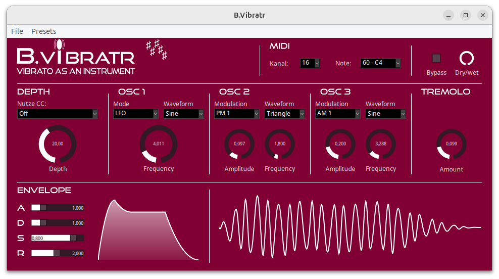

# B.Vibratr (experimental)
A "flavoured" vibrato as an instrument LV2 plugin.

**Note: This software is still under construction. There will be major modifications which may break compatibility. Don't use it for production!!!**

Key features:
* Effect plugin, but play it like an instrument
* Modifies sound of other instruments / samples




## Installation

a) Install the bvibratr package for your system (once established)

b) Use the latest provided binaries (once established)

c) Build your own binaries in the following three steps.

Step 1: [Download the latest published version](https://github.com/sjaehn/BVibratr/releases) of B.Vibratr. 
Or clone or [download the master](https://github.com/sjaehn/BVibratr/archive/master.zip) of this repository.

Step 2: Install pkg-config and the development packages for x11, cairo, and lv2 if not done yet. If you
don't have already got the build tools (compilers, make, libraries) then install them too.

On Debian-based systems you may run:
```
sudo apt-get install build-essential
sudo apt-get install pkg-config libx11-dev libcairo2-dev lv2-dev
```

On Arch-based systems you may run:
```
sudo pacman -S base-devel
sudo pacman -S pkg-config libx11 cairo lv2
```

Step 3: Building and installing into the default lv2 directory (/usr/local/lib/lv2/) is easy using `make` and
`make install`. Simply call:
```
make
sudo make install
```

**Optional:** Standard `make` and `make install` parameters are supported. You may build a debugging version using
`make CPPFLAGS+=-g`. For installation into an alternative directory (e.g., /usr/lib/lv2/), change the
variable `PREFIX` while installing: `sudo make install PREFIX=/usr`. If you want to freely choose the
install target directory, change the variable `LV2DIR` (e.g., `make install LV2DIR=~/.lv2`) or even define
`DESTDIR`.

**Optional:** Further supported parameters are `LANGUAGE` (two letters code) to change the GUI language and
`SKIN` to change the skin (see customize).


## Running

After the installation Ardour, Carla, and any other LV2 host should automatically detect B.Vibratr.

If jalv is installed, you can also call it

```
jalv.gtk https://www.jahnichen.de/plugins/lv2/BVibratr
```

to run it stand-alone and connect it to the JACK system.


## Usage

**Note: B.Vibratr requires an audio input (up to 2 channels)**

```
                ┌───────────┐ 
audio_in_1 ---> │           │ ---> audio_out_1
audio_in_2 ---> │ B.Vibratr │ ---> audio_out_2
midi_in    ---> │           │ 
                └───────────┘
```

Add a vibrato effect to the audio input stream using the three
oscillators. Optionally trigger the vibrato using MIDI keys.
MIDI signaly and audio input may be routed from different soucres.


## Internationalization
B.Bibratr now uses the dictionaries of the new B.Widgets toolkit and all labels
are now automatically shown in your system language (if translation is 
provided). The dictionary for this plugin is stored in 
src/BVibratr_Dictionary.data. If you want to add a translation to your language, 
simply edit this file in your text editor und use the (POSIX) language code 
(format: language_TERRITORY) of your language. 

E. g., if you want to add a french translation of "Help", simply change
```
    {
        "Help",           
        {
            {"de_DE", "Hilfe"},
            {"it_IT", "Aiuto"}
        }
    },
```
to
```
    {
        "Help",           
        {
            {"de_DE", "Hilfe"},
            {"fr_FR", "Aide"},
            {"it_IT", "Aiuto"}
        }
    },
```

Once you changed the dictionary, you have to re-build the plugin. And please
share your translations with other users by either submitting a git pull 
request or notifying me (issue report, e-mail, ...).


## What's new

* Bypass, dry/wet
* Enable trigger on any MIDI key 
* Report plugin latency to host
* Click-safe change of osc mode


## TODOs

* Select channels using checkboxes
* Used-defined waveforms
* Internationalization
* Presets
* Multiple keys (later versions)


## License

See LICENSE


## Links

TODO