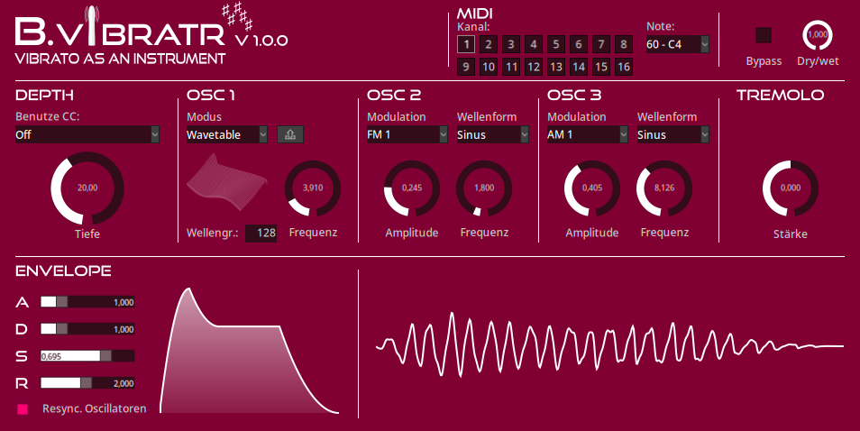

# B.Vibratr (experimental)
A "flavoured" vibrato as an instrument LV2 plugin.

**Note: This software is still under construction. There will be major modifications which may break compatibility. Don't use it for production!!!**

Key features:
* Effect plugin, but play it like an instrument
* Modifies sound of other instruments / samples




## Installation

a) Install the bvibratr package for your system (once established)

b) Use the latest provided binaries (once established)

c) Build your own binaries in the following three steps.

Step 1: [Download the latest published version](https://github.com/sjaehn/BVibratr/releases) of B.Vibratr. 
Or clone or [download the master](https://github.com/sjaehn/BVibratr/archive/master.zip) of this repository.

Step 2: Install pkg-config and the development packages for x11, cairo, and lv2 if not done yet. If you
don't have already got the build tools (compilers, make, libraries) then install them too.

On Debian-based systems you may run:
```
sudo apt-get install build-essential
sudo apt-get install pkg-config libx11-dev libcairo2-dev lv2-dev
```

On Arch-based systems you may run:
```
sudo pacman -S base-devel
sudo pacman -S pkg-config libx11 cairo lv2
```

Step 3: Building and installing into the default lv2 directory (/usr/local/lib/lv2/) is easy using `make` and
`make install`. Simply call:
```
make
sudo make install
```

**Optional:** Standard `make` and `make install` parameters are supported. You may build a debugging version using
`make CPPFLAGS+=-g`. For installation into an alternative directory (e.g., /usr/lib/lv2/), change the
variable `PREFIX` while installing: `sudo make install PREFIX=/usr`. If you want to freely choose the
install target directory, change the variable `LV2DIR` (e.g., `make install LV2DIR=~/.lv2`) or even define
`DESTDIR`.

**Optional:** Further supported parameters are `LANGUAGE` (two letters code) to change the GUI language and
`SKIN` to change the skin (see customize).


## Running

After the installation Ardour, Carla, and any other LV2 host should automatically detect B.Vibratr.

If jalv is installed, you can also call it

```
jalv.gtk https://www.jahnichen.de/plugins/lv2/BVibratr
```

to run it stand-alone and connect it to the JACK system.


## Usage

### Step 1: Connect B.Vibratr

B.Vibratr doesn't generate any sound by itself, but it manipulates sound using
MIDI inputs. Thus it needs to be connected to both, a MIDI input and a 
(stereo) audio input. And of course a (stereo) audio output. 

```
                ┌───────────┐ 
audio_in_1 ---> │           │ ---> audio_out_1
audio_in_2 ---> │ B.Vibratr │ ---> audio_out_2
midi_in    ---> │           │ 
                └───────────┘
```

There are at least two ways to realize the MIDI input:
* In series after a synthesizer that offers MIDI through. In this case, you 
can use both, MIDI and audio signal comming from the synth. 
* In parallel to an audio stream-producing instrument or sampler. In this 
case, you can use the audio signal from your instrument, but you will need an
additional MIDI input to use all the features from B.Vibratr.


### Step 2: Set a trigger

You can apply vibrato upon a MIDI trigger or you can make B.Vibratr permanetly
play a vibrato, depending on your settings.

Select the MIDI channels and the MIDI note (or any note) to use as a trigger.
If you use B.Vibratr in series after a MIDI instrument that offers MIDI 
through, then think about to select channels or notes which are **not** used
the instrument. Unless you want to get the B.Vibratr effect on a specific
instrument or channel.

You can select one or multiple channels to trigger B.Vibrator to play. 
However, if you select **no** channel, then B.Vibratr is permanently running
(TODO). 


### Step 3: The vibrato waveforms 

You have got an ADSR envelope and up to three oscillators to generate
waveforms for the vibrato pitch changes. In addition, you can combine it with
a tremolo change in volume.

The depth of the pitch change can be set using the depth parameter. Naturally
sounding vibratos are in the lower cents range and up to 30 cents. The depth 
parameter can externally be cotrolled using the MIDI CC option (e.g.,
modulation wheel) without plugin signal routing/automatization.

There are three oscillators to generate the vibrato pitch waveform. The first
one (OSC1) can either generate LFOs or use a pitch wavetable (TODO). In both
cases, you can set the oscillator frequency. Frequencies of naturally sounding 
vibratos differ from instrument to instrument and are typically in the range
between 4 and 8.

The other two oscillators (OSC2 and OSC3) are LFOs and can be used to 
manipulate the waveforms generated by the previous oscillators. Thus, OSC2 can
manipulate OSC1, and OSC2 can mainpulate both OSC1 and OSC2. Supported 
manipulation are signal addition (add), frequency modulation (FM), phase 
modulation (PM) and amplitude modulation (AM). In addition to the oscillator
frequency, you can also set the amplitude (amount) of the respective 
oscillator OSC2 and OSC3. 

In addition to the vibrato effect, you can apply a tremolo volume effect. The 
tremolo is parallelized to the vibrato change in pitch. Thus, the higher the 
pitch, the higher the volume.

Finally, B.Vibratr uses a standard ADSR envelope to control the vibrato depth
and the tremolo amount.


### Appendix: Wavetables

You can import wavetables into B.Vibratr from simple .wvt text files or from
wavetable synthesizer-compatible audio files (e.g., .wav) (TODO). It contains
one floating point value on each line for each sample. For more details see
[wvt.md](doc/wvt.md).

TODO: You can also import wavetables created for other synthesizers in the 
.wav or other audio formats. They often have got 256, 512, 1024, 2048 or even
more samples per frame depending on the synthesizer created for and the
respective specification.

TODO: The wavetables are used by the B.Vibratr algorithm to calculate
mathematical integral wavetables which are then used by the oscillator OSC1.

**Note:** Wavetable files usually contain raw audio signal data in the 
dependency of time. The frequency of the signal represents it pitch. However,
B.Vibratr expects pitch signals in the dependency of time.


## Internationalization
B.Bibratr now uses the dictionaries of the new B.Widgets toolkit and all labels
are now automatically shown in your system language (if translation is 
provided). The dictionary for this plugin is stored in 
src/BVibratr_Dictionary.data. If you want to add a translation to your language, 
simply edit this file in your text editor und use the (POSIX) language code 
(format: language_TERRITORY) of your language. 

E. g., if you want to add a french translation of "Help", simply change
```
    {
        "Help",           
        {
            {"de_DE", "Hilfe"},
            {"it_IT", "Aiuto"}
        }
    },
```
to
```
    {
        "Help",           
        {
            {"de_DE", "Hilfe"},
            {"fr_FR", "Aide"},
            {"it_IT", "Aiuto"}
        }
    },
```

Once you changed the dictionary, you have to re-build the plugin. And please
share your translations with other users by either submitting a git pull 
request or notifying me (issue report, e-mail, ...).


## What's new

* Bypass, dry/wet
* Enable trigger on any MIDI key 
* Report plugin latency to host
* Click-safe change of osc mode
* Select channels using checkboxes
* Used-defined waveforms
  * Import wavetables from text files
  * Show wavetables
  * Wavetable file chooser
* Documentation (incomplete)


## TODOs

* Used-defined waveforms
  * Communicate wavetables from UI to DSP (and vice versa)
  * Store and restore wavetables
  * Calculate integrals of pitch wavetables
  * Wavetable oscillator
  * Import wavetables from wav
  * Simple tools for wavetable manipulation
* Internationalization
* Presets
* Documentation
* Multiple keys (later versions)


## License

See [LICENSE](LICENSE)


## Links

TODO